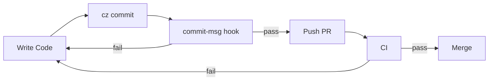

# Onboarding

Welcome! 👋  
This repository is designed to provide **fast feedback**, **strong quality gates**, and **clear expectations** from day one.

This project assumes familiarity with Git, pull requests, and basic JVM tooling.  
The guardrails exist to make those workflows **safer and more predictable**, not to teach them from scratch.

If you follow the steps below, you should be able to:

- Get the project running locally
- Make your first PR confidently
- Understand *why* the guardrails exist (not just what they are)

---

## 🚑 Doctor first (important)

Before running Gradle, tests, or Docker-heavy workflows, always start with:

```bash
make doctor
```

This performs **local-only environment sanity checks** and fails fast with clear, actionable errors  
(e.g. missing Java 21, Docker not running, Colima misconfigured).

All other commands assume `make doctor` already passes.

📄 Details: [`DOCTOR.md`](../../DOCTOR.md)

---

## 🚀 Quick start (recommended)

After cloning the repo, run:

```bash
make bootstrap
```

This is the **single supported entry point** for new contributors.

> `make bootstrap` is safe to re-run at any time.  
> It only installs or fixes what’s missing.

### What `make bootstrap` does

1. Installs repo-local Git hooks (including commit message validation)
2. Runs `make doctor` to verify your local environment
3. Runs the local quality gate (formatting + static checks)
4. Fixes common macOS permission issues
5. Fails fast if your environment is misconfigured

📄 Details: [`MAKEFILE.md`](../MAKEFILE.md)

---

## 🧭 How onboarding is structured

Onboarding docs are intentionally **progressive**. You don’t need to read everything at once.

### Day-based flow

| When | What to read |
| ---- | ---- |
| Day 1 | [`DAY_1_ONBOARDING.md`](./DAY_1_ONBOARDING.md) — local setup, expectations |
| Day 2 | [`DAY_2_FIRST_PR.md`](./DAY_2_FIRST_PR.md) — first PR, CI, review flow |

---

## 🧑‍💻 Development workflow

```text
Code → cz commit → commit-msg hook → PR → CI → review → merge
```



### 📝 Commit messages (important)

This project **enforces Conventional Commits** to support:

- semantic versioning
- clean changelogs
- reliable release automation

#### ✅ Preferred way to commit

```bash
cz commit
```

This interactive command:

- guides you through the correct commit format
- prevents rejected commits
- keeps history consistent across contributors

#### ⚠️ About `git commit`

You *can* use `git commit` **only if** you already know the correct format.

If the message is invalid:

- the `commit-msg` hook will reject it
- you’ll be asked to fix the message before committing

> **Rule of thumb:**  
> Use `cz commit` unless you have a specific reason not to.

📄 Details:

- [`docs/commit/COMMITIZEN.md`](../commit/COMMITIZEN.md)
- [`docs/adr/ADR-007-commit-msg.md`](../adr/ADR-007-commit-msg.md)

---

## 🧱 Quality gates & ADRs

All non-obvious rules are documented as Architecture Decision Records.

If something passes locally but fails in CI, treat that as a **documentation gap**, not a contributor mistake.

### Core ADRs

- ADR-000 — Linting & quality gates  
- ADR-001 — PostgreSQL everywhere  
- ADR-002 — Testcontainers  
- ADR-003 — Actuator health checks  
- ADR-004 — `.env` & config precedence  
- ADR-005 — Phased security  
- ADR-007 — Commit message enforcement (Commitizen)

📄 Index: [`docs/adr/README.md`](../adr/README.md)

---

## 🧪 Testing & CI

📄 Start here:

- [`docs/testing/LOCAL_TESTING.md`](../testing/LOCAL_TESTING.md)
- [`docs/testing/TESTING.md`](../testing/TESTING.md)
- [`docs/testing/CI_TROUBLESHOOTING.md`](../testing/CI_TROUBLESHOOTING.md)

---

## 🐳 Docker & local services

📄 Docs:

- [`DOCKER.md`](../enviroment/DOCKER.md)
- [`docker-compose.yml`](../../docker-compose.yml)

---

## 🛠️ Local dev environment

📄 Docs:

- [`LOCAL_ENVIRONMENT.md`](../enviroment/LOCAL_CONFIG.md)
- [`.vscode/README.md`](../../.vscode/README.md)

---

## 🆘 If you’re stuck

1. Re-run `make doctor`
2. Check the relevant setup document
3. Read the linked ADR
4. If something is unclear, open a PR or issue — docs are part of the system

---

## 🧠 Guiding principle

> **Run doctor first.  
> Use `cz commit` for guidance.  
> Let hooks fail fast.  
> CI protects the system.  
> ADRs explain why.**

Welcome aboard 🚀
